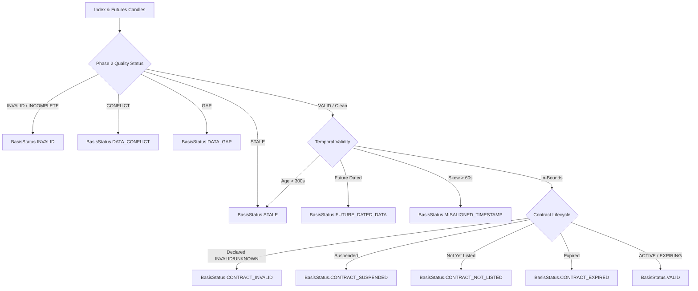

# AlphaForge ? Phase 4: Basis Data Quality & Validation Rules

---

## 1. Overview

The **Basis Data Quality Model** bridges the Phase 2 Market Data Governance Layer and Phase 3 Contract Lifecycle Engine into the Phase 4 Basis Engine. The basis engine enforces a strict fail-closed contract: any defect, anomaly, or ambiguity in either the spot or futures input stream prevents basis computation and marks the observation invalid.

Crucially, the basis engine **never fabricates market prices** and **never reports placeholder basis values**:
- If prices are missing, non-positive, or non-finite, price fields are set to `None` (never `1`).
- For any defective or non-VALID observation, `basis` and `basis_pct` are strictly set to `None` (never `0`).
- The observation clearly and auditably indicates that no valid basis calculation occurred.

---

## 2. Phase 2 Data Quality Mapping Matrix

The Basis Engine inspects the `DataQualityStatus` of both the spot index candle and the futures candle. If either candle has an execution-blocking status, the observation fails closed according to the following precedence matrix:

| Input Data Quality Status | Basis Engine Status (`BasisStatus`) | Basis Values | Confirmation Status | Rationale |
| :--- | :--- | :--- | :--- | :--- |
| `VALID` | Evaluates next gates | Computed ($F - S$) | Depends on z-score | Clean candle data conforms to mathematical OHLC requirements. |
| `INVALID` | `INVALID` | `None` | `INVALID` | Mathematical inconsistency or schema violation. |
| `CONFLICT` | `DATA_CONFLICT` | `None` | `INVALID` | Divergent tick data or multiple non-identical candles for same timestamp. |
| `GAP` | `DATA_GAP` | `None` | `INVALID` | Missing expected bar in interval sequence. |
| `STALE` | `STALE` | `None` | `INVALID` | Zero volume or repeated flat pricing across expected active intervals. |
| `INCOMPLETE` | `INVALID` | `None` | `INVALID` | Incomplete bar missing OHLCV constituents. |
| `OUT_OF_ORDER` | Normalized / Recovered | Computed if valid | Depends on z-score | Out-of-order bars are deterministically re-sorted by Phase 2 normalizer. |
| `DUPLICATE` | Normalized / Recovered | Computed if valid | Depends on z-score | Identical duplicate bars are deduplicated by Phase 2 normalizer. |

---

## 3. Temporal Governance & Timestamp Alignment

### 3.1 Future-Dated Data Protection (Causality Gate)
To prevent look-ahead bias and simulated timestamps leaked from future bars:
$$\text{If } \tau_{\text{index}} > \tau_{\text{eval}} \quad \text{or} \quad \tau_{\text{futures}} > \tau_{\text{eval}} \implies \mathbf{BasisStatus.FUTURE\_DATED\_DATA} \ (\text{basis} = \text{None})$$

### 3.2 Maximum Staleness Gate
To ensure the basis observation reflects current market conditions:
$$\text{If } (\tau_{\text{eval}} - \tau_{\text{index}}) > 300\text{s} \quad \text{or} \quad (\tau_{\text{eval}} - \tau_{\text{futures}}) > 300\text{s} \implies \mathbf{BasisStatus.STALE} \ (\text{basis} = \text{None})$$

### 3.3 Timestamp Skew & Alignment Gate
In high-frequency and multi-asset environments, index and futures bars may close with slight clock skew. A maximum skew corridor of 60 seconds is permitted:
$$\Delta t = |\tau_{\text{futures}} - \tau_{\text{index}}|$$
$$\text{If } \Delta t > 60\text{s} \implies \mathbf{BasisStatus.MISALIGNED\_TIMESTAMP} \ (\text{basis} = \text{None})$$

---

## 4. Instrument & Contract Lifecycle Governance

### 4.1 Underlying Symbol Consistency
The spot index and derivative futures contract must share the exact underlying instrument:
$$\text{If } \text{symbol}_{\text{index}} \ne \text{contract.underlying\_symbol} \quad \text{or} \quad \text{symbol}_{\text{futures}} \ne \text{contract.underlying\_symbol} \implies \mathbf{BasisStatus.UNDERLYING\_MISMATCH} \ (\text{basis} = \text{None})$$

### 4.2 Contract Identity Verification
The futures candle `contract_id` must match the registered `ContractMaster.contract_id`:
$$\text{If } \text{candle}_{\text{futures}}.\text{contract\_id} \ne \text{contract}.\text{contract\_id} \implies \mathbf{BasisStatus.UNDERLYING\_MISMATCH} \ (\text{basis} = \text{None})$$

### 4.3 Phase 3 Lifecycle State Integration
The futures contract is evaluated dynamically via `evaluate_contract_lifecycle(contract, eval_ts)`:
- **`ContractStatus.INVALID` or `ContractStatus.UNKNOWN`:** Evaluates to `BasisStatus.CONTRACT_INVALID` (`basis = None`).
- **`ContractStatus.SUSPENDED` or `contract.is_suspended == True`:** Evaluates to `BasisStatus.CONTRACT_SUSPENDED` (`basis = None`).
- **`ContractStatus.NOT_YET_LISTED`:** Evaluates to `BasisStatus.CONTRACT_NOT_LISTED` (`basis = None`).
- **`ContractStatus.EXPIRED`:** Evaluates to `BasisStatus.CONTRACT_EXPIRED` (`basis = None`).
- **`ContractStatus.ACTIVE` or `ContractStatus.EXPIRING`:** Passes lifecycle gate.

---

## 5. Price Sanity & Numerical Finiteness

Both `index_candle.close` and `futures_candle.close` must strictly be positive finite `Decimal` values:
- Non-positive prices ($P \le 0$) immediately trigger `BasisStatus.INVALID` with price set to `None`.
- Non-finite numbers (`NaN`, `Infinity`, `-Infinity`) trigger `BasisStatus.INVALID` with price set to `None`.
- Never use placeholder prices such as `1` or fallback basis values such as `0`.
- Silent rounding or float truncation is strictly forbidden.
