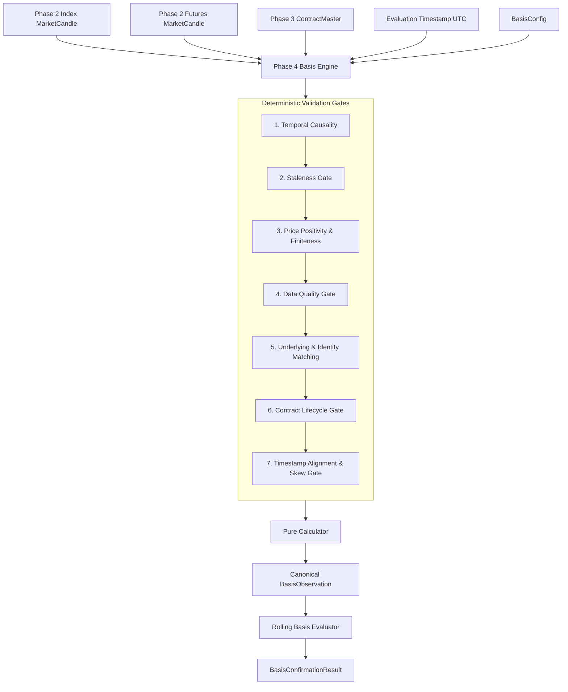

# AlphaForge ? Phase 4: Index?Futures Basis Engine Specification

---

## 1. Overview and Purpose

The **Index?Futures Basis Engine** evaluates the structural price relationship between an underlying spot index and its corresponding derivative futures contract. In the AlphaForge trading architecture, basis evaluation serves as a deterministic market-structure and regime confirmation layer that informs trade eligibility without altering underlying strategy signals.

The basis engine operates as a strictly pure, deterministic, fail-closed pipeline:
- Consumes normalized Phase 2 `MarketCandle` objects for index and futures.
- Evaluates contract lifecycle and eligibility against Phase 3 `ContractMaster`.
- Verifies timestamp alignment, data quality, causality, and staleness.
- Computes absolute basis and normalized percentage basis using fixed-point `Decimal` arithmetic.
- Derives rolling statistics (rolling mean, sample standard deviation with Bessel's correction, z-score).
- Emits canonical, immutable `BasisObservation` and `BasisConfirmationResult` records.
- Guarantees zero synthetic fallback values: invalid observations never contain fabricated prices (such as `1`) or placeholder basis numbers (such as `0`).

---

## 2. Structural Isolation and Phase Boundaries

The Basis Engine maintains strict phase boundaries:
- **Phase 1 Strategy Preservation:** The basis engine does not modify Phase 1 indicators (EMA, ATR, Volume SMA) or breakout rules.
- **Phase 2 Data Governance Dependency:** Consumes validated candles from Phase 2 without bypassing normalization or quality gates.
- **Phase 3 Contract Master Dependency:** Enforces strict contract lifecycle state, tick alignment, and expiry awareness from Phase 3.
- **Strict Phase 5+ Exclusion:** Contains zero risk management, position sizing, order execution, broker connectivity, WebSocket feeds, or stateful background workers.
- **Safety Lockdown:** `LIVE_TRADING = FALSE` is strictly enforced across all components.

---

## 3. Data Models and Canonical Contracts

All domain models are defined in `alphaforge/basis/models.py` as immutable Pydantic models (`frozen=True`, `extra="forbid"`):

### 3.1 `BasisConfig`
Governs operational parameters with strict positive thresholds:
- `max_timestamp_skew_seconds: Decimal = Decimal("60")` (Maximum permissible temporal skew between index and futures candles).
- `max_stale_seconds: Decimal = Decimal("300")` (Maximum permissible age of either candle relative to evaluation time).
- `rolling_window_size: int = 20` (Fixed observation history depth for rolling statistics).
- `z_score_lower_threshold: Decimal = Decimal("-2.5")` (Authoritative lower boundary for NORMAL classification).
- `z_score_upper_threshold: Decimal = Decimal("2.5")` (Authoritative upper boundary for NORMAL classification).
- `calculation_version: int = 1` (Deterministic schema version tag).

### 3.2 `BasisObservation`
The canonical observation schema containing 15 strictly typed fields. When an observation is defective or invalid, numeric calculation fields are strictly `None` to prevent fabricated values from appearing numerically valid:
1. `underlying_symbol: str` (e.g., `"NIFTY"`)
2. `index_contract_id: str` (e.g., `"NIFTY-SPOT"`)
3. `futures_contract_id: str` (e.g., `"NIFTY26JUNFUT"`)
4. `index_price: Decimal | None` (Real candle price, or `None` if non-positive/non-finite; never `1`)
5. `futures_price: Decimal | None` (Real candle price, or `None` if non-positive/non-finite; never `1`)
6. `basis: Decimal | None` ($F - S$ when valid, strictly `None` when defective; never `0`)
7. `basis_pct: Decimal | None` ($(F - S) / S$ when valid, strictly `None` when defective; never `0`)
8. `index_timestamp: datetime` (UTC)
9. `futures_timestamp: datetime` (UTC)
10. `evaluation_timestamp: datetime` (UTC)
11. `timestamp_skew_seconds: Decimal`
12. `data_quality: DataQualityStatus`
13. `contract_status: ContractStatus`
14. `basis_status: BasisStatus`
15. `calculation_version: int`

### 3.3 `RollingBasisStats`
Captures historical distribution context:
- `count: int` (Number of observations in window).
- `window_size: int` (Configured window size, default 20).
- `rolling_mean: Decimal | None` (Mean basis percentage).
- `rolling_std: Decimal | None` (Sample standard deviation using $N-1$ Bessel correction).
- `z_score: Decimal | None` ($(X - \mu) / \sigma$).
- `z_score_status: BasisZScoreStatus` (`LOWER`, `NORMAL`, `HIGHER`, or `UNDEFINED`).

### 3.4 `BasisConfirmationResult`
Output of the confirmation evaluation gate:
- `status: BasisConfirmationStatus` (`CONFIRMED`, `NOT_CONFIRMED`, or `INVALID`).
- `observation: BasisObservation`
- `rolling_stats: RollingBasisStats | None`
- `reason: str` (Explanatory deterministic audit code).

---

## 4. Evaluation Pipeline Architecture

The basis evaluation entry point `evaluate_basis(...)` in `alphaforge/basis/engine.py` implements the following verification sequence:

### Step 1: Temporal Causality Check
Prevents look-ahead bias. If `index_candle.timestamp > evaluation_timestamp` or `futures_candle.timestamp > evaluation_timestamp`, evaluation fails closed with `BasisStatus.FUTURE_DATED_DATA`.

### Step 2: Staleness Gate
Ensures data freshness. If either `(evaluation_timestamp - index_candle.timestamp) > max_stale_seconds` or `(evaluation_timestamp - futures_candle.timestamp) > max_stale_seconds`, evaluation fails closed with `BasisStatus.STALE`.

### Step 3: Price Positivity & Finiteness Gate
Both `index_candle.close` and `futures_candle.close` must be finite positive Decimals ($> 0$). Non-positive or non-finite prices immediately evaluate to `BasisStatus.INVALID` with price fields set to `None`.

### Step 4: Data Quality Validation Gate
Evaluates the Phase 2 `DataQualityStatus` of both candles:
- If either candle is `INVALID` -> `BasisStatus.INVALID`
- If either candle is `CONFLICT` -> `BasisStatus.DATA_CONFLICT`
- If either candle is `GAP` -> `BasisStatus.DATA_GAP`
- If either candle is `STALE` -> `BasisStatus.STALE`
- If either candle is `INCOMPLETE` -> `BasisStatus.INVALID`

### Step 5: Underlying and Contract Identity Check
- Both `index_candle.symbol` and `futures_candle.symbol` must match `contract.underlying_symbol`.
- `futures_candle.contract_id` must match `contract.contract_id`.
- Any discrepancy results in `BasisStatus.UNDERLYING_MISMATCH`.

### Step 6: Contract Lifecycle Gate (Phase 3 Integration)
The contract is evaluated against `evaluate_contract_lifecycle(contract, evaluation_timestamp)`:
- Declared status `INVALID` or `UNKNOWN` -> `BasisStatus.CONTRACT_INVALID`
- Declared status `SUSPENDED` or `is_suspended=True` -> `BasisStatus.CONTRACT_SUSPENDED`
- Dynamic status `NOT_YET_LISTED` -> `BasisStatus.CONTRACT_NOT_LISTED`
- Dynamic status `EXPIRED` -> `BasisStatus.CONTRACT_EXPIRED`
- Only contracts evaluating to `ACTIVE` or `EXPIRING` pass to calculation.

### Step 7: Timestamp Alignment & Skew Gate
Calculates absolute difference:
$$\Delta t = |\text{timestamp}_{\text{futures}} - \text{timestamp}_{\text{index}}|$$
If $\Delta t > \text{max\_timestamp\_skew\_seconds}$, evaluation fails closed with `BasisStatus.MISALIGNED_TIMESTAMP`.

### Step 8: Pure Calculation
When all gates pass, `calculate_basis(...)` and `calculate_basis_pct(...)` compute the final values and return a `BasisObservation` with `basis_status = BasisStatus.VALID`.

---

## 5. Basis Confirmation Gate & Regime Rules

The confirmation evaluator `evaluate_basis_confirmation(...)` assesses structural regime using the configured thresholds from `BasisConfig`:
1. **Observation Health:** If `observation.basis_status != BasisStatus.VALID`, returns `BasisConfirmationStatus.INVALID`.
2. **Sample Sufficiency:** If history count $< 20$, returns `BasisConfirmationStatus.NOT_CONFIRMED` with reason `"INSUFFICIENT_HISTORY"`.
3. **Statistical Validity:** If standard deviation is zero or undefined, returns `BasisConfirmationStatus.NOT_CONFIRMED` with reason `"ZERO_OR_UNDEFINED_STANDARD_DEVIATION"`.
4. **Z-Score Boundaries (Inclusive for NORMAL):**
   - If $Z_t < \text{z\_score\_lower\_threshold}$ (`LOWER`), returns `BasisConfirmationStatus.NOT_CONFIRMED` with reason code explicitly indicating extreme lower basis z-score.
   - If $Z_t > \text{z\_score\_upper\_threshold}$ (`HIGHER`), returns `BasisConfirmationStatus.NOT_CONFIRMED` with reason code explicitly indicating extreme higher basis z-score.
   - If $\text{z\_score\_lower\_threshold} \le Z_t \le \text{z\_score\_upper\_threshold}$ (`NORMAL`), returns `BasisConfirmationStatus.CONFIRMED`.
   - Threshold boundaries are strictly inclusive for `NORMAL` ($Z_t = \text{lower}$ and $Z_t = \text{upper}$ evaluate to `CONFIRMED`).
   - Configured thresholds in `BasisConfig` are authoritative; no hard-coded thresholds exist in confirmation logic.
