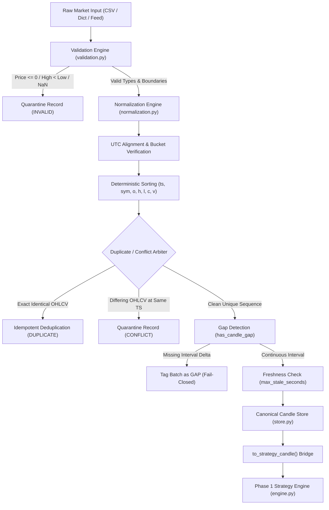

# AlphaForge — Data Governance Specification

---

## 1. Governance Principles & Invariants

AlphaForge enforces deterministic data governance across all market data ingestion, transformation, and storage pipelines. The market data layer serves as the single authoritative source of truth for downstream quantitative components (Strategy Engine, Basis Engine, Risk Engine).

### Core Invariants:

1. **Deterministic Ingestion:** Given the identical sequence of raw market records, the pipeline produces the bit-exact identical sequence of canonical `MarketCandle` objects and data quality classifications.
2. **Zero Data Imputation:** Missing candle intervals are detected, flagged as `DataQualityStatus.GAP`, and handled fail-closed. The system **never forward-fills, linear-interpolates, or invents synthetic market data**.
3. **Deterministic Conflict Quarantine:** If two or more records share the identical composite key `(symbol, timeframe, exchange_timestamp)` but contain divergent OHLCV values, the system **never** silently overwrites or arbitrates based on arrival order. All conflicting records are quarantined with status `CONFLICT` and excluded from strategy consumption.
4. **Idempotent Deduplication:** Exact duplicate records (identical composite key and identical OHLCV) are safely and idempotently collapsed into a single canonical record.
5. **Closed-Candle Isolation Boundary:** In-flight forming candles (index `[0]`) are strictly isolated from closed historical candles (indices `[1..N]`). The Strategy Engine evaluates signals exclusively on closed candles.
6. **Temporal Causality & No Lookahead:**
   - Ingestion arrival timestamp (`received_timestamp`) must never precede exchange timestamp (`exchange_timestamp`).
   - Candle timestamps must never be strictly in the future relative to the evaluation context timestamp (`evaluation_timestamp`).
7. **Fixed-Point Precision:** All price representations use Python `Decimal` with positive boundaries ($P > 0$). Floating-point arithmetic is strictly prohibited in price storage and verification.

---

## 2. Ingestion Pipeline Architecture

The end-to-end data ingestion and governance pipeline operates as a deterministic, unidirectional sequence:

$$\text{Raw Market Data} \longrightarrow \text{Validation} \longrightarrow \text{Normalization} \longrightarrow \text{Timestamp / Timezone Alignment} \longrightarrow \text{Ordering} \longrightarrow \text{Duplicate / Conflict Handling} \longrightarrow \text{Gap Detection} \longrightarrow \text{Data Quality Status} \longrightarrow \text{Candle Store} \longrightarrow \text{Phase 1 Strategy Input}$$

---

## 3. Boundary Alignment & Timeframe Governance

AlphaForge enforces strict candle interval boundary validation:
- All timestamps must be explicitly timezone-aware in UTC (`UTC.utcoffset(ts) == timedelta(0)`).
- Sub-minute precision is strictly zeroed: `second == 0` and `microsecond == 0`.
- Candlestick bucket boundaries must satisfy:
  - `1m`: `minute % 1 == 0`
  - `3m`: `minute % 3 == 0` (e.g. 09:15, 09:18, 09:21, 09:24, ...)
  - `5m`: `minute % 5 == 0` (e.g. 09:15, 09:20, 09:25, ...)
  - `15m`: `minute % 15 == 0` (e.g. 09:15, 09:30, 09:45, 10:00, ...)
  - `1h`: `minute == 0`
  - `1d`: `hour == 0 and minute == 0`

Timestamps violating boundary alignment are rejected with `DataIntegrityError`.

---

## 4. Zero Volume & Illiquid Market Policy

- **Volume Invariant:** $volume \ge 0$.
- **Index Spot Feeds:** Volume for index spot (e.g., NIFTY 50 Index) is reported as `0` by the exchange. `volume == 0` is valid for index spot feeds.
- **Futures Feeds:** Futures contracts generally exhibit positive volume during active sessions. While zero volume is technically valid during halted or pre-market sessions, negative volume ($volume < 0$) is mathematically impossible and immediately quarantined as `INVALID`.

---

## 5. Storage & Lifecycle Isolation

Phase 2 implements an in-memory, deterministic `CandleStore` interface:
- **Index:** `(symbol, timeframe)`.
- **Closed Candle Series:** Stored chronologically in an immutable list.
- **Forming Candle State:** Maintained separately in a forming store (`is_closed=False`).
- **Bridge to Strategy Engine:** `get_strategy_execution_input()` produces the exact reverse-chronological sequence required by Phase 1 (`[0]` forming, `[1]` trigger closed bar, `[2..N]` older closed bars), ensuring zero contamination of signal evaluation.
