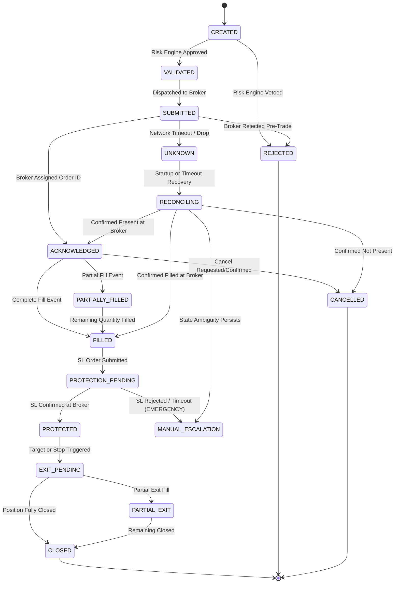

# ALPHAFORGE — EXECUTION FORENSIC SPECIFICATION & ORDER LIFECYCLE

**Project Name:** AlphaForge  
**Author:** Principal Execution Systems Engineer, Reliability Engineer  
**Date:** 2026-09-12  
**Status:** Approved Execution & Reconciliation Specification  
**Baseline Reference:** AlphaForge Master Constitution (Sections 13, 14, 15, 16)

---

## 1. Execution Engine Philosophy

A trading strategy must never interface directly with a broker API. The Execution Engine is an asynchronous, failure-tolerant orchestrator responsible for:
- Idempotent order dispatch.
- Atomic state transitions across the 17-state lifecycle.
- Emergency position protection (Stop-Loss enforcement).
- Broker reconciliation and crash recovery.

---

## 2. Formal 17-State Order Lifecycle Machine

AlphaForge defines an explicit finite state machine (FSM). Any undefined or illegal state transition triggers an immediate exception, locks order flow, and writes an audit failure event.



### 2.1 Complete State Enumeration
1. `CREATED`: Initial order intent generated by strategy.
2. `VALIDATED`: Approved by Risk Engine against all risk invariants.
3. `REJECTED`: Rejected by internal Risk Engine or pre-trade broker check.
4. `SUBMITTED`: Payload transmitted over wire to broker gateway.
5. `ACKNOWLEDGED`: Broker confirmed receipt and allocated `broker_order_id`.
6. `PARTIALLY_FILLED`: Execution reported for a fraction of order quantity.
7. `FILLED`: Entry order 100% executed.
8. `PROTECTION_PENDING`: Protection order (Stop-Loss) dispatched, awaiting confirmation.
9. `PROTECTED`: Stop-loss order confirmed resting on broker exchange order book.
10. `EXIT_PENDING`: Exit order (target or stop) submitted.
11. `PARTIAL_EXIT`: Partial execution of exit order.
12. `CLOSED`: Position completely flat, PnL realized.
13. `CANCELLED`: Order cancelled without any fill.
14. `UNKNOWN`: In-flight order lost network ACK or connection dropped.
15. `RECONCILING`: Actively querying broker state to resolve order status.
16. `MANUAL_ESCALATION`: Critical failure requiring human intervention.

---

## 3. Emergency Unprotected Position Protocol (P0 Hazard)

A position that transitions to `FILLED` without confirmed resting stop protection within a strict timeout ($T_{protect} = 5\text{ seconds}$) is classified as an **EMERGENCY (UNPROTECTED POSITION)**.

```text
[ POSITION FILLED ]
        |
        v
[ SUBMIT STOP-LOSS ORDER ] ---> Timeout (>5s) or Rejected by Broker?
        |                                       |
        | (Success)                             | (Failure)
        v                                       v
[ STATE = PROTECTED ]           [ TRIGGER P0 EMERGENCY PROTOCOL ]
                                                |
                                                +---> 1. Halt all new strategy entries.
                                                +---> 2. Fire high-priority sound & pager alert.
                                                +---> 3. Query broker position immediately.
                                                +---> 4. Submit immediate Market Exit Order.
                                                +---> 5. If exit fails, transition to MANUAL_ESCALATION.
```

Blind retries without reconciliation are strictly prohibited.

---

## 4. Idempotency Architecture & Identity Model

To prevent double execution after timeouts or duplicate webhook callbacks, every action carries deterministic cryptographic identities:

```python
client_order_id = sha256(
    f"{strategy_id}:{strategy_version}:{signal_id}:{attempt_id}"
).hexdigest()[:24]
```

When network communication fails:
1. **Never** submit a new order with a new ID.
2. **Never** assume the previous order failed.
3. Query the broker order book using `client_order_id`.
4. If found: reconcile state (`ACKNOWLEDGED` or `FILLED`).
5. If definitively confirmed absent: re-evaluate submission or abort.

---

## 5. Cold-Boot Crash Recovery Protocol (9 Steps)

Upon startup or process reboot, AlphaForge executes the following mandatory 9-step sequence before any trading logic is unlocked:

1. **Step 1:** Load local database records of open orders and active positions.
2. **Step 2:** Load persistent state machine status.
3. **Step 3:** Establish authenticated connection to broker REST/WebSocket API.
4. **Step 4:** Query broker for all active orders (`GET /orders`).
5. **Step 5:** Query broker for all current open positions (`GET /positions`).
6. **Step 6:** Cross-compare local vs broker records (detect ghost orders, missing fills, or manual trades).
7. **Step 7:** Reconcile differences: align local state machine to broker ground truth.
8. **Step 8:** Verify that every open position has an active, confirmed Stop-Loss order on the exchange.
9. **Step 9:** If and only if all positions are verified protected and reconciled, unlock signal processing. Otherwise, transition to `MANUAL_ESCALATION`.
